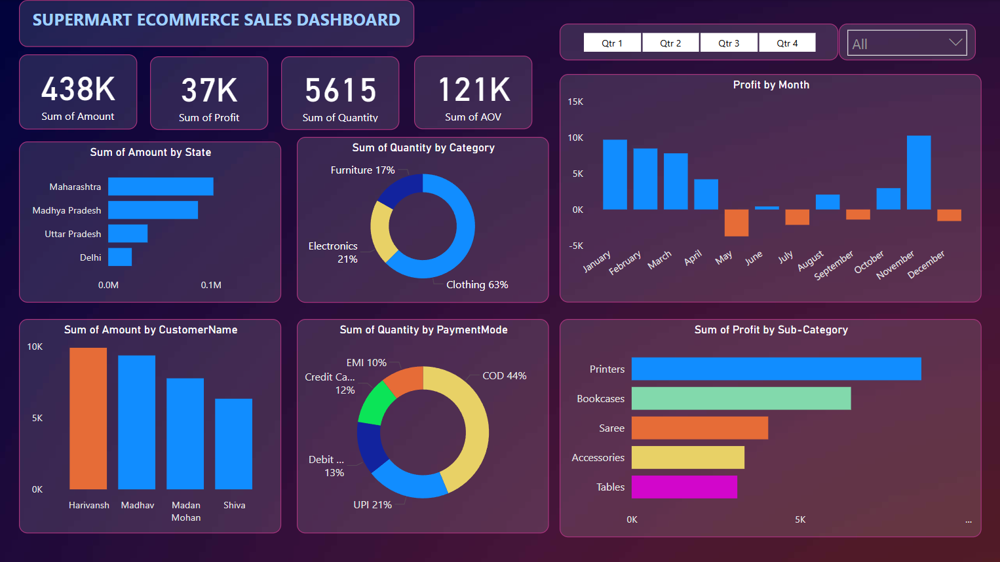

# 🛒 SuperMart Sales Dashboard

---

## ✅ Overview

An interactive Power BI report to analyze SuperMart’s e-commerce sales, profit trends, top customers, product categories, and payment methods.

> A dynamic, easy-to-explore sales analytics dashboard designed to help stakeholders track performance, identify profit drivers, and spot sales opportunities across states and product categories.

---

## ✏️ Short Description / Purpose

The **SuperMart Sales Dashboard** is a learning-based Power BI project built to practice data modeling, DAX measures, and interactive visualization techniques.  
It provides clear, actionable insights for understanding regional sales patterns, customer contributions, and product category performance.

---

## 🛠️ Tech Stack

The dashboard was developed using the following tools and technologies:

- 📊 **Power BI Desktop** — Core BI tool for report building.
- 🔍 **Power Query** — Used for data cleaning and shaping before modeling.
- 🧩 **DAX (Data Analysis Expressions)** — Created calculated columns and measures for dynamic visuals.
- 📐 **Data Modeling** — Designed relationships between tables to enable cross-filtering and drill-downs.
- 📁 **File Formats** — `.pbix` for the report file and `.png` for dashboard previews.

---

## 🗂️ Data Source

⚠️ **Disclaimer:**  
This project uses a sample dataset for demonstration and learning purposes only.  
The original source of the data is unknown and may be subject to its own copyright or usage restrictions.

---

## ⚙️ Features / Highlights

### • Business Problem
SuperMart’s sales managers need an interactive view of sales, profit, and customer trends to make informed decisions — but raw spreadsheets make this analysis inefficient and error-prone.

### • Goal of the Dashboard
To create an interactive dashboard that:
- Provides a clear overview of total sales, profit, and order volume.
- Highlights top-performing states, customers, categories, and payment methods.
- Enables dynamic filtering and drill-downs for deeper insights.

### • Walkthrough of Key Visuals

- **Executive Summary Cards:**  
  Quick KPIs for Total Sales Amount, Profit, Quantity Sold, and Average Order Value (AOV).

- **Regional Insights:**  
  Bar charts display **Sales by State** and identify **Top Customers** by sales contribution.

- **Category Analysis:**  
  Donut charts show **Quantity Sold by Category** and **Payment Mode Preferences**.  
  Bar charts reveal **Profit by Sub-Category**, highlighting profitable and loss-making product lines.

- **Time Series Trends:**  
  Monthly profit trends show seasonal peaks and dips.  
  Interactive quarter slicers let users focus on specific time periods.

- **Dynamic Filtering:**  
  Slicers and dropdown filters allow drill-downs by region, product category, and time period.

- **Modern Visual Design:**  
  Consistent color palette and intuitive layout for easy navigation and quick insights.

### • Business Impact & Insights

- Sales teams can target high-profit states and loyal customers.
- Product managers can identify best-selling and underperforming categories.
- Executives gain a high-level view of seasonal trends and payment preferences.

---

## 📸 Screenshots / Demo

**Dashboard Preview:**

---

## 🚀 How to Use

1. Download or clone this repository.
2. Open the `.pbix` file in **Power BI Desktop**.
3. Use slicers and dropdown filters to explore sales trends by state, category, and customer.
4. Hover over visuals for detailed tooltips and drill-downs.

---

## 📜 License

The visuals, report design, and DAX measures in this project are released under the [MIT License](./LICENSE).

⚠️ **Data Source Disclaimer:**  
This dataset is for learning and demonstration only. Use at your own discretion.

---

## 📘 Project Context

This dashboard was built as part of a **learning exercise** to practice:
- Connecting and transforming data with Power Query.
- Building data models and relationships.
- Creating calculated measures and columns with DAX.
- Designing clean, interactive reports in Power BI.

---

